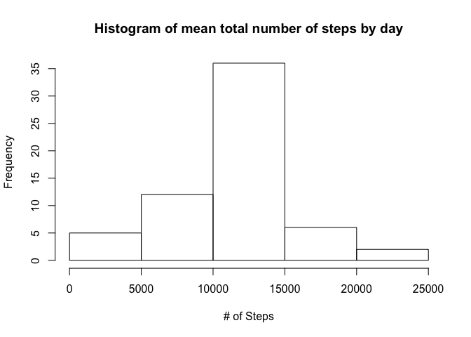
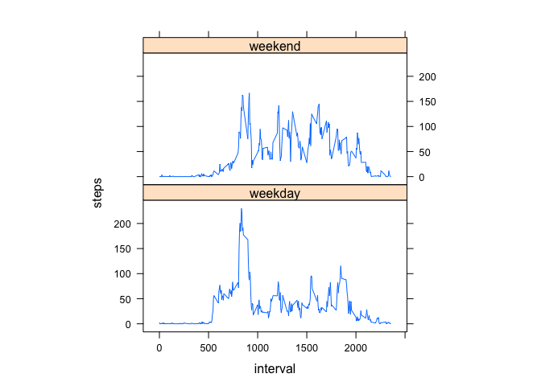

# Reproducible Research: Peer Assessment 1


## Loading and preprocessing the data
- Load data by read.csv and store it into `df_raw`

```r
df_raw <- read.csv('./activity.csv', header=TRUE)
```

- Remove `NA` values and store it into `df`

```r
df <- df_raw[!is.na(df_raw$steps),]
```

## What is mean total number of steps taken per day?
- Aggregate steps data by date and store into `df_by_day`

```r
df_by_day <- aggregate(steps~date,data=df,sum,na.rm=TRUE)
```

- Draw histogram 

```r
hist(df_by_day$steps, main="Histogram of mean total number of steps by day",xlab="# of Steps")
```

 

- Calculate the mean and median of the total number of steps taken per day

```r
mean_steps <- mean(df_by_day$steps)
median_steps <- median(df_by_day$steps)
```

Mean of total number of steps taken per day is **10766.19**.
Median of total number of steps taken per day is **10765**.


## What is the average daily activity pattern?

- Caculate and plot the average daily activity pattern. First aggregate average steps by interval into `df_interval`, then plot the relationship of steps and interval. 

```r
df_interval <- aggregate(steps~interval,data=df,mean,na.rm=TRUE)
plot(steps~interval,data=df_interval,type="l")
```

 

```r
max_interval <- df_interval[which.max(df_interval$steps),]$interval
```


On average across all the days in the dataset, the interval that contains the maximum number of steps is **`835`**.

## Imputing missing values

- Calculate and report the total number of missing values in the dataset

```r
num_of_NAs <- sum(is.na(df_raw$steps))
```

The total number of missing values is **`2304`**.

- Create a new dataset `df_fill` and fill in missing `NA`s.  The average steps of the corresponding interval is used to replace the missing value.


```r
df_fill <- df_raw
for (i in 1:nrow(df_fill)){
  if (is.na(df_fill[i,]$steps)){
    df_fill[i,]$steps = df_interval[df_interval$interval==df_fill[i,]$interval,]$steps
  }
}
```

- Aggregate steps data by date and store in `df_fill`

```r
df_fill_by_day <- aggregate(steps~date,data=df_fill,sum,na.rm=TRUE)
```

- Draw histogram 

```r
hist(df_fill_by_day$steps, main="Histogram of mean total number of steps by day",xlab="# of Steps")
```

 

- Calculate the mean and median of the total number of steps taken per day

```r
mean_steps_fill <- mean(df_fill_by_day$steps)
median_steps_fill <- median(df_fill_by_day$steps)
```

Mean of total number of steps taken per day is **10766.19**.
Median of total number of steps taken per day is **10766.19**.

After imputing missing values, the median value of total number of steps taken per day increases slightly and the mean value does not show noticeable difference.

## Are there differences in activity patterns between weekdays and weekends?


```r
df_fill$weekday <- ifelse(weekdays(as.Date(df_fill$date))=="Saturday"|weekdays(as.Date(df_fill$date))=="Sunday","weekend","weekday")
df_fill$weekday <- factor(df_fill$weekday,levels=c("weekday","weekend"))
```


```r
library(lattice)
df_interval_2 <- aggregate(steps~interval+weekday, df_fill, mean)
xyplot(steps~interval|factor(weekday), data=df_interval_2, aspect=1/2, type="l")
```

 

The plot indicates that 

- In weekdays, a peak of steps exists around interval 700-800.

- In weekend, activities between interval 1100-1700 is higher than weekdays.
